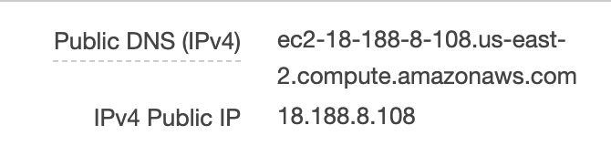
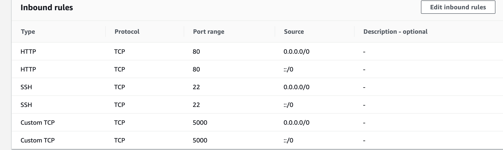

# video-zongxinc

###
This project helps to download contents from twitter and convert the word into image and then construct a video out of these images in a multithreading manner. To run this program, you need to construct a 'keys' files which contains the keys you get from twitter in following manner:

[auth]
consumer_key = ****
consumer_secret = ****
access_token = ****
access_secret = ****

###
Currently the project is available on aws

input in following manner: @Username

accessing the web through aws via 

ec2-18-220-92-202.us-east-2.compute.amazonaws.com:5000

or(if above does not work)

18.220.185.253:5000

